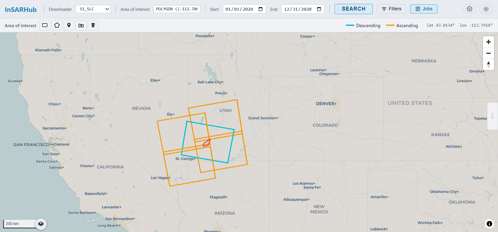

# InSARHub

InSARHub is a modular Python framework for automated InSAR and time-series processing.

The primary goal of this package is to provide a streamlined and user-friendly InSAR processing experience across multiple satellite products.

## Table of Contents
- [Web UI](#web-ui)
- [Installation](#installation)
- [Requirements](#requirements)
- [Usage](#usage)
- [CLI](#cli)
- [Documentation](#documentation)

## Web UI

InSARHub includes a **self-hosted web interface** that covers the full InSAR workflow — from scene search and download through interferogram processing to time-series analysis.
```bash
insarhub-app
```

Open `http://localhost:8000` to access the UI.

### Features

| Panel | What it does |
|-------|-------------|
| **Search & Download** | Draw an AOI on the map, search Sentinel-1 SLC stacks, download scenes and precise orbit files |
| **Processor** | Select interferogram pairs from a network graph, submit to HyP3, monitor job status, and download results |
| **Analyzer** | Run time-series analysis with configurable steps; view progress live in the log |
| **Results Viewer** | Overlay the velocity map on the basemap; click any pixel to plot its displacement time series |

All data stays on your machine — InSARHub runs a local FastAPI server and delivers a modern React frontend directly in your browser.

See the [Web UI documentation](https://jldz9.github.io/InSARHub/) for a full walkthrough.

<picture>
  <source media="(prefers-color-scheme: dark)"  srcset="docs/frontend/fig/overview_dark.png">
  <source media="(prefers-color-scheme: light)" srcset="docs/frontend/fig/overview_light.png">
  
</picture>

---

## Installation

InSARHub can be installed using Conda:
```bash
conda install insarhub -c conda-forge
```
Pip:

```bash
conda install gdal -c conda-forge
pip install insarhub
```

From source: 

```bash
git clone https://github.com/jldz9/InSARHub.git
cd InSARHub
conda env create -f environment.yml -n insarhub_dev 
conda activate insarhub_dev
pip install -e .
```

## Requirements
- Python >=3.11,<3.13
- numpy <2.0
- proj >=9.4
- gdal >=3.8
- sqlite >=3.44
- mintpy
- asf_search 
- colorama 
- contextily 
- dem_stitcher 
- hyp3_sdk 
- rasterio >=1.4
- sentineleof
- pyproj
- fastapi
- uvicorn
- python-multipart

## Usage 

### Downloader:

```python
from insarhub import Downloader
```

- View available downloaders

    ```python
    Downloader.available()
    ```
- Create downloader

    ```python
    dl = Downloader.create('S1_SLC',
                            intersectsWith=[-113.05, 37.74, -112.68, 38.00],
                            start='2020-01-01',
                            end='2020-12-31',
                            relativeOrbit=100,
                            frame=466,
                            workdir='path/to/dir')
    ```

- Search
    ```python
    results = dl.search()
    ```

- Filter
    ```python
    filter_result = dl.filter(start='2020-02-01')
    ```

- Download

    ```python
    dl.download()
    ```

### Processor:

```python
from insarhub import Processor
```
- View available processors
    ```python
    Processor.available()
    ```

- Create Processor

    ```python
    processor = Processor.create('Hyp3_InSAR', workdir='/your/work/path', pairs=pairs)
    ```

- Submit Jobs
    ```python
    jobs = processor.submit()
    ```

- Refresh Jobs

    ```python
    jobs = processor.refresh()
    ```
- Download Succeeded Jobs

    ```python
    processor.download()
    ```


### Analyzer

```python
from insarhub import Analyzer
```
- View available analyzers
    ```python
    Analyzer.available()
    ```

- Create Analyzer

    ```python
    analyzer = Analyzer.create('Hyp3_SBAS', workdir="/your/work/dir")
    ```
- Prepare data

    ```python
    analyzer.prep_data()
    ```

- Run time-series analysis
    ```python
    analyzer.run()
    ```

## CLI

InSARHub includes a command-line interface for running the full pipeline without writing Python code, suitable for HPC batch jobs and scripted workflows.

```bash
insarhub <command> [options]
```

### End-to-end example

```bash
# Search scenes and select interferogram pairs
insarhub downloader -N S1_SLC \
    --AOI -113.05 37.74 -112.68 38.00 \
    --start 2020-01-01 --end 2020-12-31 \
    --stacks 100:466 \
    -w /data/bryce \
    --select-pairs

# Submit pairs to HyP3 (auto-reads pairs_p*_f*.json from workdir subfolders)
insarhub processor -N Hyp3_InSAR  -w /data/bryce submit

# Wait for jobs and download results automatically
insarhub processor -N Hyp3_InSAR  -w /data/bryce watch

# Run MintPy time-series analysis
insarhub analyzer -N Hyp3_SBAS -w /data/bryce run
```

### Commands

| Command | Description |
|---------|-------------|
| `insarhub downloader` | Search scenes, select interferogram pairs, and download data |
| `insarhub processor`  | Submit and manage InSAR processing jobs |
| `insarhub analyzer`   | Run time-series analysis on processed interferograms |
| `insarhub utils`      | Helper utilities (pair selection, network plot, SLURM, ERA5, clip) |

Use `insarhub <command> --help` for full option details, or see the [CLI Reference](https://jldz9.github.io/InSARHub/quickstart/cli/).

## Documentation

[InSARHub documentation](https://jldz9.github.io/InSARHub/)

