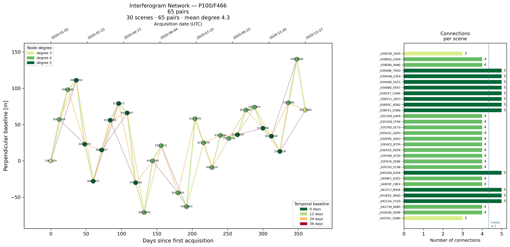

Utilities are sets of tools designed to support and streamline InSAR processing workflows.


### Select Pairs

Select interferogram pairs from ASF search results based on temporal and perpendicular baseline criteria.

```python
from insarhub import Downloader
from insarhub.utils import select_pairs

s1 = Downloader.create('S1_SLC',
                    intersectsWith=[-113.05, 37.74, -112.68, 38.00],
                    start='2020-01-01',
                    end='2020-12-31',
                    relativeOrbit=100,
                    frame=466,
                    workdir='path/to/dir')
results = s1.search()

pairs, baselines, scene_bperp = select_pairs(search_results=results)
```

::: insarhub.utils.select_pairs
    options:
        members: false
        heading_level: 0


### Plot Pair Network

Plot the SBAS interferogram network returned by `select_pairs`.

```python
from insarhub.utils import plot_pair_network

fig = plot_pair_network(pairs=pairs, baselines=baselines, scene_baselines=scene_bperp)
fig.show()
```

Example: 

{:  margin: auto;" }


::: insarhub.utils.plot_pair_network
    options:
        members: false
        heading_level: 0

### ERA5 Downloader

Download ERA5 pressure-level weather data for MintPy tropospheric correction. Automatically determines required acquisition dates and spatial extents from HyP3 zip files and saves files using MintPy-compatible naming (`ERA5_S*_N*_W*_E*_YYYYMMDD_HH.grb`). Requires a `~/.cdsapirc` file with your [CDS API](https://cds.climate.copernicus.eu/api-how-to) credentials.

```python
from insarhub.utils import ERA5Downloader

era5 = ERA5Downloader(output_dir='path/to/era5', num_processes=3, max_retries=3)
era5.download_batch(batch_dir='path/to/hyp3/outputs')
```

::: insarhub.utils.ERA5Downloader
    options:
        members:
            - download_batch
        heading_level: 0

### Earth Credit Pool

If user have multiple Earthdata credentials, user may storage it under ~/.credit_pool with format 
```bash
username1:password1
username2:password2
```
then read use:
```python
from isnarscript.utils import earth_credit_pool
ec_pool = earth_credit_pool()
```
You may then pass this into processor for seameless switch across multiple Earthdata credentials

```python
from insarhub import Processor
processor= Processor.create('Hyp3_InSAR', earthdata_credentials_pool=ec_pool, ....)
```

::: insarhub.utils.earth_credit_pool
    options:
        members: false
        heading_level: 0

### Slurm Job Config

This class encapsulates all parameters needed to generate a SLURM batch script,
    including resource allocation, job settings, environment configuration, and
    execution commands.

```python
from insarhub.utils import Slurmjob_Config
config = SlurmJobConfig(
            job_name="my_analysis",
            time="02:00:00",
            command="python analyze.py"
        )
config.to_script("analysis.slurm")
```

::: insarhub.utils.Slurmjob_Config
    options:
        members: false
        heading_level: 0

