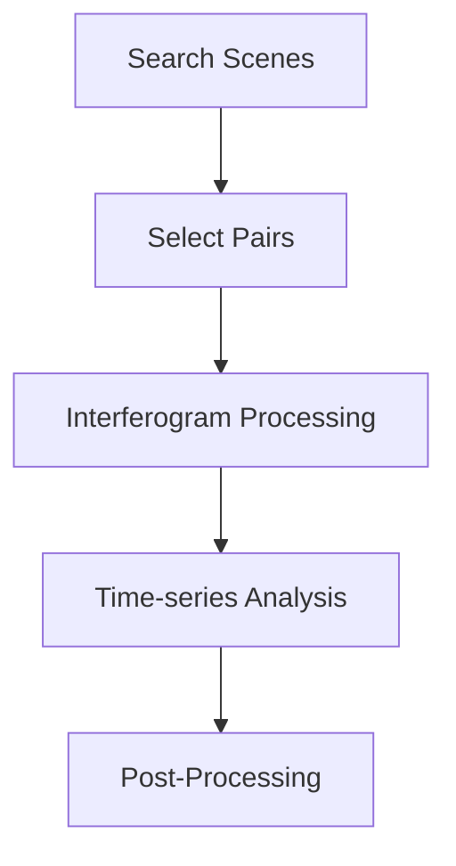

The InSARHub CLI (`insarhub`) exposes the full processing pipeline — search, process, analyze, and utility tools — as a single command-line program suitable for both interactive use and HPC batch submission.

```bash
insarhub <command> [options]
```

Use `-v` / `--version` to check the installed version, and `--help` on any command or sub-action for inline reference:

```bash
insarhub --version
insarhub --help
insarhub downloader --help
insarhub analyzer run --help
```

## Workflow

<div style="text-align: center;">

</div>

---

## downloader

Search for satellite scenes and optionally select interferogram pairs or download data.

```bash
insarhub downloader [options]
```

### Downloader selection

| Flag | Default | Description |
|------|---------|-------------|
| `-N`, `--name` | `S1_SLC` | Downloader to use (see `--list-downloaders`) |
| `--list-downloaders` | — | Print all registered downloaders and exit |
| `--list-options` | — | Print all config fields for the selected downloader |
| `-w`, `--workdir` | cwd | Working directory |
| `--config` | `<workdir>/downloader_config.json` | Path to a saved downloader config JSON; omit the value to use the default path |

```bash
# List available downloaders
insarhub downloader --list-downloaders

# List all config fields for S1_SLC (reads saved config if present)
insarhub downloader -N S1_SLC --list-options
```

After the first run, a `downloader_config.json` is written to `workdir` with the full resolved config. On subsequent runs, this file is automatically loaded as defaults — so you only need to specify what changed:

```bash
# First run: full options required
insarhub downloader -N S1_SLC --AOI -113.05 37.74 -112.68 38.00 \
    --start 2020-01-01 --end 2020-12-31 --stacks 100:466 -w /data/bryce

# Subsequent run: config reloaded from /data/bryce/downloader_config.json
insarhub downloader -N S1_SLC -w /data/bryce

# Use a different config file
insarhub downloader --config /other/path/my_config.json

# Load default config path without specifying a value
insarhub downloader -N S1_SLC --config
```

Any config field shown by `--list-options` can be set directly as an extra flag:

```bash
insarhub downloader -N S1_SLC --start 2020-01-01 --end 2020-12-31 \
    --relativeOrbit 100 --frame 466
```

### Area of Interest

| Flag | Description |
|------|-------------|
| `--AOI` | Bounding box as `minlon minlat maxlon maxlat`, a GeoJSON/shapefile path, or a WKT string |
| `--stacks` | Restrict to specific track/frame stacks as `PATH:FRAME` tokens |

```bash
# Bounding box
insarhub downloader --AOI -113.05 37.74 -112.68 38.00

# Specific stacks (takes precedence over --relativeOrbit / --frame)
insarhub downloader --stacks 100:466 20:118
```

### Pair selection

Add `--select-pairs` to run interferogram pair selection after search. Results are saved as `pairs_p<path>_f<frame>.json` inside a `p<path>_f<frame>/` subfolder under `workdir` — one file per track/frame group. `insarhub processor submit` automatically finds these files in the same `workdir`, so no extra flags are needed to hand off pairs between the two steps.

| Flag | Default | Description |
|------|---------|-------------|
| `--select-pairs` | — | Select pairs after search |
| `--dt-targets` | `6 12 24 36 48 72 96` | Target temporal spacings in days |
| `--dt-tol` | `3` | Tolerance in days around each target |
| `--dt-max` | `120` | Maximum temporal baseline (days) |
| `--pb-max` | `150.0` | Maximum perpendicular baseline (m) |
| `--min-degree` | `3` | Minimum connections per scene |
| `--max-degree` | `999` | Maximum connections per scene |
| `--force-connect` / `--no-force-connect` | enabled | Force connectivity for isolated scenes |
| `--sp-workers` | `8` | Threads for API baseline fallback |
| `--pairs-output` | `<workdir>/pairs.json` | Output file path |

```bash
insarhub downloader -N S1_SLC \
    --AOI -113.05 37.74 -112.68 38.00 \
    --start 2020-01-01 --end 2020-12-31 \
    --stacks 100:466 \
    --select-pairs --dt-max 96 --pb-max 150
```

### Download

| Flag | Default | Description |
|------|---------|-------------|
| `-d`, `--download` | — | Download scenes after search |
| `-O`, `--orbit-files` | — | Also download orbit files (Sentinel-1 only) |
| `--workers` | `3` | Parallel download workers |
| `--footprint` | `<workdir>/footprint.png` | Save a footprint map image to this path |

```bash
# Search, select pairs, and download in one command
insarhub downloader -N S1_SLC \
    --AOI -113.05 37.74 -112.68 38.00 \
    --start 2020-01-01 --end 2020-12-31 \
    --select-pairs --download --orbit-files \
    --footprint footprint.png
```

---

## processor

Submit interferogram pairs to a processing backend and manage the job lifecycle.

```bash
insarhub processor [--list-processors] <action> [options]
```

| Flag | Description |
|------|-------------|
| `--list-processors` | Print all registered processors and exit |

### submit

Submit pairs to a registered processor (default: `Hyp3_InSAR`).

```bash
insarhub processor submit [options]
```

| Flag | Default | Description |
|------|---------|-------------|
| `-N`, `--name` | `Hyp3_InSAR` | Processor to use |
| `--list-options` | — | Print all config fields for the selected processor |
| `-w`, `--workdir` | cwd | Working directory |
| `--config` | `<workdir>/processor_config.json` | Path to a saved processor config JSON; omit the value to use the default path |
| `--credential-pool` | — | JSON file mapping `{username: password}` for multi-account HyP3 submission |
| `--name-prefix` | `ifg` | Job name prefix |
| `--max-workers` | `4` | Parallel submission workers |
| `--dry-run` | — | Print what would be submitted without sending jobs |
| `--pairs-file` | auto | JSON file from `downloader --select-pairs` |
| `--pairs` | — | Inline pairs as `"reference,secondary"` strings |

After a successful submission, `processor_config.json` is written to `workdir`. On subsequent runs it is loaded automatically, so you only need to specify overrides:

```bash
# First run
insarhub processor submit -N Hyp3_InSAR -w /data/bryce

# Re-submit with saved config (no extra flags needed)
insarhub processor submit -w /data/bryce

# Use a custom config file
insarhub processor submit --config /other/config.json
```

When no `--pairs-file` is given, `submit` automatically looks for `pairs_p<path>_f<frame>.json` files inside `p<path>_f<frame>/` subfolders under `workdir` — the files written by `downloader --select-pairs`. A separate HyP3 job batch is submitted for each group found.

```bash
# Submit from auto-detected pairs.json in workdir
insarhub processor submit -w /data/bryce

# Submit with a specific pairs file, dry run first
insarhub processor submit -w /data/bryce --pairs-file /data/pairs.json --dry-run

# Inline pairs
insarhub processor submit --pairs "S1A_20200101,S1A_20200113"
```

### refresh

Pull the latest job statuses from HyP3.

```bash
insarhub processor refresh -w /data/bryce
insarhub processor refresh -w /data/bryce --job-file /data/bryce/hyp3_jobs.json
```

### download

Download all completed HyP3 job outputs.

```bash
insarhub processor download -w /data/bryce
```

### retry

Resubmit all failed jobs.

```bash
insarhub processor retry -w /data/bryce
```

### watch

Poll HyP3 at regular intervals until all jobs complete, downloading results as they succeed.

| Flag | Default | Description |
|------|---------|-------------|
| `--interval` | `300` | Seconds between refresh polls |

```bash
insarhub processor watch -w /data/bryce --interval 600
```

### credits

Show remaining HyP3 processing credits.

```bash
insarhub processor credits -w /data/bryce
```

---

## analyzer

Prepare HyP3 data and run MintPy SBAS time-series analysis.

```bash
insarhub analyzer [-N ANALYZER] [-w WORKDIR] [config overrides] <action> [options]
```

| Flag | Default | Description |
|------|---------|-------------|
| `-N`, `--name` | `Hyp3_SBAS` | Analyzer to use (see `--list-analyzers`) |
| `-w`, `--workdir` | cwd | Working directory containing HyP3 results |
| `--list-analyzers` | — | Print all registered analyzers and exit |
| `--list-options` | — | Print all config fields for the selected analyzer |

### Config overrides

Any field shown by `--list-options` can be overridden directly on the `analyzer` command before specifying an action. The value is written into `mintpy.cfg` so it persists across runs.

```bash
# See current config values (reads mintpy.cfg if it exists)
insarhub analyzer -N Hyp3_SBAS -w /data/bryce --list-options

# Override a single field without running any steps
insarhub analyzer -N Hyp3_SBAS -w /data/bryce --compute_maxMemory 30

# Override and then run
insarhub analyzer -N Hyp3_SBAS -w /data/bryce --compute_maxMemory 30 run
```

If `workdir` contains multiple `p*_f*` subfolders (one per track/frame), config overrides and analysis are applied to each subfolder in sequence.

### run

Run the analysis workflow. Omitting `--step` runs the full pipeline (`prep` + all MintPy steps).

```bash
insarhub analyzer -N Hyp3_SBAS -w /data/bryce run [--step STEP...] [--debug]
```

| Flag | Default | Description |
|------|---------|-------------|
| `--step` | all | Step(s) to run (space-separated; see table below) |
| `--debug` | — | Enable MintPy debug mode |

#### Available steps

| Step keyword | Description |
|---|---|
| `prep` | Prepare HyP3 data (unzip, clip, configure MintPy) |
| `all` | `prep` + all MintPy steps below (default when `--step` is omitted) |
| `load_data` | Load interferograms and geometry into MintPy HDF5 |
| `modify_network` | Apply network modification rules |
| `reference_point` | Select reference pixel |
| `invert_network` | Invert the interferogram network (SBAS) |
| `correct_LOD` | Correct for local oscillator drift |
| `correct_SET` | Correct for solid Earth tides |
| `correct_ionosphere` | Correct ionospheric delay |
| `correct_troposphere` | Correct tropospheric delay |
| `deramp` | Remove orbital/ramp signal |
| `correct_topography` | Correct topographic residuals |
| `residual_RMS` | Compute residual RMS for outlier detection |
| `reference_date` | Select reference date |
| `velocity` | Estimate linear velocity |
| `geocode` | Geocode outputs to geographic coordinates |
| `google_earth` | Generate Google Earth KMZ |
| `hdfeos5` | Export to HDF-EOS5 format |

```bash
# Full pipeline (default)
insarhub analyzer -N Hyp3_SBAS -w /data/bryce run

# Prepare data only
insarhub analyzer -N Hyp3_SBAS -w /data/bryce run --step prep

# Run a single MintPy step
insarhub analyzer -N Hyp3_SBAS -w /data/bryce run --step velocity

# Run multiple steps
insarhub analyzer -N Hyp3_SBAS -w /data/bryce run --step geocode velocity

# Override config and run
insarhub analyzer -N Hyp3_SBAS -w /data/bryce --compute_maxMemory 30 run
```

Each executing step is printed as `Step N/Total: step_name` so progress is visible in batch logs.

### cleanup

Remove temporary files and zip archives generated during processing.

```bash
insarhub analyzer -N Hyp3_SBAS -w /data/bryce cleanup
```

| Flag | Description |
|------|-------------|
| `--debug` | Dry-run mode — print what would be removed without deleting anything |

---

## utils

Standalone utility tools for data preparation, pair selection, network visualisation, and HPC job generation.

```bash
insarhub utils <tool> [options]
```

### clip

Clip HyP3 zip file contents to an AOI before running MintPy. Useful when working with scenes that extend well beyond the study area.

```bash
insarhub utils clip -w /data/bryce --aoi -113.05 37.74 -112.68 38.00
insarhub utils clip -w /data/bryce --aoi study_area.geojson
```

| Flag | Default | Description |
|------|---------|-------------|
| `-w`, `--workdir` | cwd | Directory containing HyP3 `.zip` files |
| `--aoi` | required | AOI as `minlon minlat maxlon maxlat` or path to GeoJSON/shapefile |

### h5-to-raster

Convert a MintPy HDF5 output file (e.g. `velocity.h5`) to GeoTIFF.

```bash
insarhub utils h5-to-raster -i velocity.h5
insarhub utils h5-to-raster -i velocity.h5 -o velocity.tif
```

| Flag | Default | Description |
|------|---------|-------------|
| `-i`, `--input` | required | Input HDF5 file |
| `-o`, `--output` | same name as input with `.tif` | Output GeoTIFF path |

### save-footprint

Extract the valid-data footprint polygon from a raster and save it as a vector file.

```bash
insarhub utils save-footprint -i velocity.h5
insarhub utils save-footprint -i velocity.h5 -o footprint.geojson
```

| Flag | Default | Description |
|------|---------|-------------|
| `-i`, `--input` | required | Input raster file |
| `-o`, `--output` | auto-named beside input | Output vector file path |

### select-pairs

Select interferogram pairs from a saved asf_search GeoJSON results file.
Input is a GeoJSON saved from `asf_search.ASFSearchResults.geojson()` or produced via `insarhub downloader`.
Output is a JSON file containing pairs, pairwise baselines, and signed per-scene perpendicular baselines.

```bash
insarhub utils select-pairs -i results.geojson -o pairs.json
insarhub utils select-pairs -i results.geojson --dt-max 96 --pb-max 150 --plot network.png
```

| Flag | Default | Description |
|------|---------|-------------|
| `-i`, `--input` | required | GeoJSON file with asf_search results |
| `-o`, `--output` | `pairs.json` | Output JSON file |
| `--dt-targets` | `6 12 24 36 48 72 96` | Target temporal spacings in days |
| `--dt-tol` | `3` | Tolerance in days around each target |
| `--dt-max` | `120` | Maximum temporal baseline (days) |
| `--pb-max` | `150.0` | Maximum perpendicular baseline (m) |
| `--min-degree` | `3` | Minimum connections per scene |
| `--max-degree` | `999` | Maximum connections per scene |
| `--no-force-connect` | — | Disable forced connectivity for isolated scenes |
| `--max-workers` | `8` | Threads for API baseline fallback |
| `--plot` | — | Also save a network plot to this path |

The output JSON contains three keys:

```json
{
  "pairs":       [["scene_a", "scene_b"], ...],
  "baselines":   {"scene_a|||scene_b": [dt_days, bperp_m], ...},
  "scene_bperp": {"scene_id": signed_bperp_m, ...}
}
```

### plot-network

Plot the interferogram network from a `pairs.json` file produced by `select-pairs`.
Node y-positions follow the MintPy convention (signed perpendicular baseline relative to the anchor scene).

```bash
insarhub utils plot-network -i pairs.json -o network.png
insarhub utils plot-network -i pairs.json --title "Path 100 Frame 466" --figsize 20 8
```

| Flag | Default | Description |
|------|---------|-------------|
| `-i`, `--input` | required | Pairs JSON from `select-pairs` |
| `-o`, `--output` | `network.png` | Output figure path |
| `--title` | `Interferogram Network` | Plot title |
| `--figsize` | `18 7` | Figure width and height in inches |

### slurm

Generate a SLURM batch script for running an `insarhub` pipeline on an HPC cluster.

```bash
insarhub utils slurm \
    --job-name insar_bryce \
    --time 08:00:00 \
    --cpus 16 \
    --mem 64G \
    --partition compute \
    --conda-env insarhub \
    --command "insarhub analyzer -N Hyp3_SBAS -w /data/bryce run" \
    -o bryce.slurm
```

| Flag | Default | Description |
|------|---------|-------------|
| `--job-name` | `insarhub_job` | SLURM job name |
| `--time` | `04:00:00` | Wall-time limit (`HH:MM:SS`) |
| `--partition` | `all` | SLURM partition |
| `--nodes` | `1` | Number of nodes |
| `--ntasks` | `1` | Number of tasks |
| `--cpus` | `8` | CPUs per task |
| `--mem` | `32G` | Memory per node |
| `--gpus` | — | GPU allocation e.g. `1` or `2` |
| `--conda-env` | — | Conda environment to activate |
| `--modules` | — | Space-separated environment modules to load |
| `--mail-user` | — | Email address for job notifications |
| `--mail-type` | `ALL` | When to notify: `BEGIN`, `END`, `FAIL`, or `ALL` |
| `--account` | — | Account to charge resources to |
| `--qos` | — | Quality of Service specification |
| `--command` | required | Shell command to execute inside the job |
| `-o`, `--output` | `job.slurm` | Output script path |

The generated script follows this structure:

```bash
#!/bin/bash
#SBATCH --job-name=insar_bryce
#SBATCH --time=08:00:00
#SBATCH --cpus-per-task=16
#SBATCH --mem=64G
...

source activate insarhub

echo "Starting job on $(date)"
insarhub analyzer -N Hyp3_SBAS -w /data/bryce run
echo "Job finished on $(date)"
```

### era5-download

Download ERA5 pressure-level weather data for MintPy tropospheric correction. Scans a workdir of HyP3 zip files, determines the required acquisition dates and spatial extents automatically, and saves files using MintPy-compatible naming (`ERA5_S*_N*_W*_E*_YYYYMMDD_HH.grb`).

Requires a `~/.cdsapirc` file with your [CDS API](https://cds.climate.copernicus.eu/api-how-to) credentials.

```bash
insarhub utils era5-download -w /data/bryce -o /data/era5
insarhub utils era5-download -w /data/bryce -o /data/era5 --num-processes 5
```

| Flag | Default | Description |
|------|---------|-------------|
| `-w`, `--workdir` | required | Directory containing HyP3 zip files (scanned per subfolder) |
| `-o`, `--output` | required | Output directory for ERA5 `.grb` files |
| `--num-processes` | `3` | Parallel download workers |
| `--max-retries` | `3` | Retry attempts per file on download failure |

Already-downloaded files are skipped automatically, so the command is safe to re-run after an interrupted download.

---

## End-to-end example

The complete pipeline from search to time-series analysis:

```bash
# 1. Search and select pairs
insarhub downloader -N S1_SLC \
    --AOI -113.05 37.74 -112.68 38.00 \
    --start 2020-01-01 --end 2020-12-31 \
    --stacks 100:466 \
    -w /data/bryce \
    --select-pairs

# 2. Submit interferograms to HyP3
insarhub processor submit -w /data/bryce

# 3. Wait for jobs and auto-download when complete
insarhub processor watch -w /data/bryce

# 4. Run time-series analysis
insarhub analyzer -N Hyp3_SBAS -w /data/bryce run

# 5. Export velocity to GeoTIFF
insarhub utils h5-to-raster -i /data/bryce/p100_f466/velocity.h5
```

*[HPC]: High Performance Computing
*[HyP3]: Hybrid Pluggable Processing Pipeline
*[ASF]: Alaska Satellite Facility
*[AOI]: Area of Interest
*[SLC]: Single Look Complex
*[SBAS]: Small Baseline Subset
