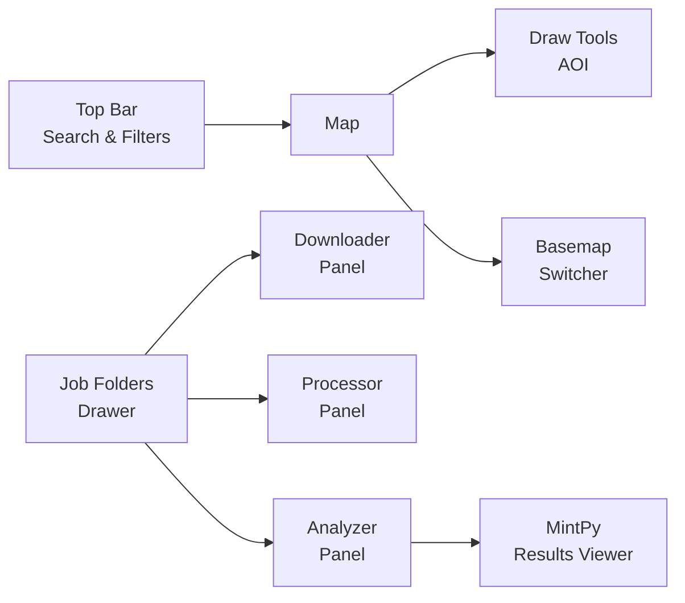

# Web UI

InSARHub includes a built-in web interface that lets you run the full InSAR workflow from a browser — no Python scripting required.

## Launch

After installing InSARHub, start the web server with:

```bash
insarhub-app
```

Then open **[http://127.0.0.1:8000](http://127.0.0.1:8000)** in your browser.

Options:

```bash
insarhub-app --host 0.0.0.0   # expose to your local network
insarhub-app --port 8080       # change port
insarhub-app --version         # print version and exit
```

---

## Interface Overview

<div style="text-align: center;">

</div>

---

## Top Bar

The top bar contains the main search controls:

| Control | Description |
|---------|-------------|
| **Start / End date** | Date range for SAR scene search |
| **Search** | Run an ASF scene search for the current AOI |
| **Settings** | Open the global settings panel |
| **Jobs** | Open the Job Folders drawer |
| **Theme** | Toggle dark / light mode |

---

## Drawing an AOI

Click one of the draw tools on the left side of the map:

| Tool | Behavior |
|------|----------|
| ⬜ **Box** | Click once to set the first corner, move mouse to preview, click again to finish |
| ⬡ **Polygon** | Click to add vertices, double-click to close |
| 📍 **Pin** | Click to place a point |
| 📂 **Shapefile** | Upload a `.zip` shapefile |

Click the active tool again to cancel drawing.

---

## Search & Results

1. Draw an AOI on the map
2. Set a date range in the top bar
3. Click **Search** — scene footprints appear on the map as colored outlines
4. Click any footprint to view scene details (path, frame, date, polarization)

---

## Settings

Click the ⚙ Settings button to configure:

- **General** — working directory, download workers
- **Auth** — Earthdata and CDSE credentials
- **Downloader** — downloader type and parameters
- **Processor** — processor type and parameters
- **Analyzer** — per-analyzer config (each analyzer type stores its own settings independently)

---

## Job Folders

Click **Jobs** to open the Job Folders drawer. InSARHub scans your working directory and lists all subfolders that contain recognized workflow files.

Each folder shows clickable role tags:

| Tag | What it means |
|-----|---------------|
| **Downloader** | Folder has a `downloader_config.json` |
| **Processor** | Folder has a `hyp3_jobs.json` |
| **Analyzer** | Folder has a `mintpy.cfg` |

Click a tag to open that role's panel. Click 🗑 to delete the entire job folder.

---

## Next Steps

For detailed usage of each panel, see:

[Downloader Panel](../advanced/frontend.md#downloader-panel){.md-button}
[Processor Panel](../advanced/frontend.md#processor-panel){.md-button}
[Analyzer Panel](../advanced/frontend.md#analyzer-panel){.md-button}
[Results Viewer](../advanced/frontend.md#mintpy-results-viewer){.md-button}
