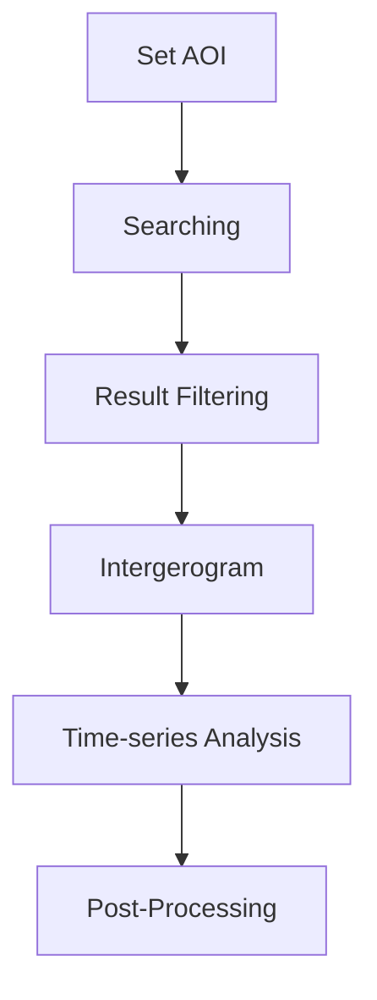
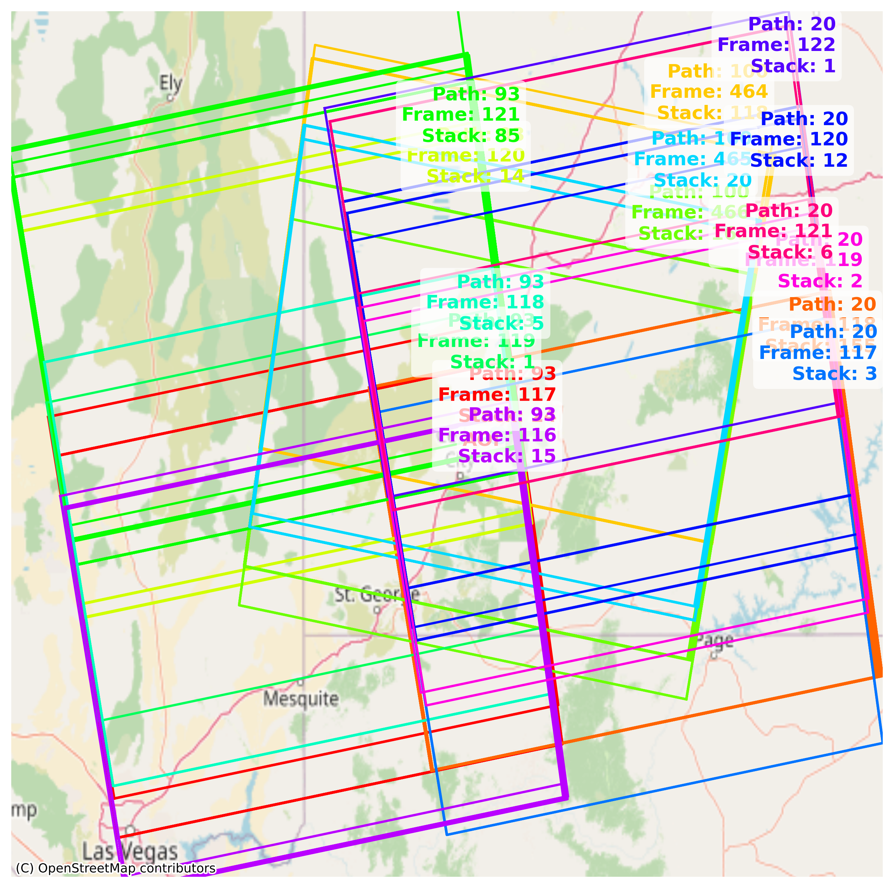

This section provides an overview of the complete InSAR time-series processing workflow, guiding you through each stage of the analysis pipeline.

## Modules 
The InSAR script is designed with three config-based main modules to cover the entire InSAR processing workflow:

[Downloader](./downloader.md){.md-button .md-button--lg} [Processor](./processor.md){ .md-button .md-button--lg} [Analyzer](./analyzer.md){ .md-button .md-button--lg}

You can click on each module to view detailed information later. For now, let's begin by running the program using the basic example.
## Workflow

The basic workflow of InSARScript can be brifely described as: 
<div style="text-align: center;">

</div>

### Set AOI

InSARScript allows to define the AOI using **bounding box**, **shapefiles**, or **WKT**:

#### Bounding box
```python
AOI = [-113.05, 37.74, -112.68, 38.00]
```
??? Note
    The AOI should be specified as ***[min_long, min_lat, max_long, max_lat]*** under CRS: EPSG:4326 (WGS84)
#### Shapefiles

```python
AOI = 'path/to/your/shapefile.shp'
```
#### WKT
```python
AOI = 'POLYGON((-113.05 37.74, -113.05 38.00, -112.68 38.00, -112.68 37.74, -113.05 37.74))'
```

### Searching
Once the AOI is defined, you can perform searches using the Downloader.

```python
from insarscript import Downloader
AOI = [-113.05, 37.74, -112.68, 38.00]
s1 = Downloader.create('S1_SLC', intersectsWith=AOI)
results = s1.search()
```
??? Output
    ```py
    Searching for SLCs....
    -- A total of 991 results found. 

    The AOI crosses 18 stacks, you can use .summary() or .footprint() to check footprints and .pick((path_frame)) to specific the stack of scence 
    you would like to download. If use .download() directly will create subfolders under /home/jldz9/dev/InSARScript for each stack
    ```

### Result Filtering
Your AOI probably spans multiple scenes. To view the search result footprints, you can use:
```python 
s1.footprint()
```
This will display a footprint map of the available Sentinel-1 scenes that covers the AOI. The stack indicates numbers of SAR sences in that footprint, becuase we have multiple stacks the graph will be a bit messy:

{: style="width:500px; display: block; margin: auto;" }

Let's check details of our SAR sence stacks and figure out which stack(s) we want to keep:
```python
s1.summary()
```
This will output the summary of availiable Sentinel-1 scenes that covers the AOI. 
??? output
    ```bash
    === ASCENDING ORBITS (14 Stacks) ===
    Path 20 Frame 117 | Count: 10 | 2015-04-05 --> 2016-11-19
    Path 20 Frame 118 | Count: 155 | 2016-12-13 --> 2026-02-12
    Path 20 Frame 119 | Count: 2 | 2015-03-24 --> 2015-12-25
    Path 20 Frame 120 | Count: 12 | 2014-10-31 --> 2016-09-14
    Path 20 Frame 121 | Count: 6 | 2015-04-05 --> 2015-08-27
    Path 20 Frame 122 | Count: 4 | 2016-05-05 --> 2016-11-19
    Path 20 Frame 123 | Count: 150 | 2016-12-13 --> 2026-02-12
    Path 93 Frame 116 | Count: 85 | 2014-11-05 --> 2021-12-16
    Path 93 Frame 117 | Count: 24 | 2015-03-29 --> 2026-02-17
    Path 93 Frame 118 | Count: 5 | 2016-10-07 --> 2017-01-11
    Path 93 Frame 119 | Count: 1 | 2017-02-10 --> 2017-02-10
    Path 93 Frame 120 | Count: 14 | 2015-11-12 --> 2025-07-04
    Path 93 Frame 121 | Count: 85 | 2014-11-05 --> 2021-12-16
    Path 93 Frame 122 | Count: 21 | 2025-05-05 --> 2026-02-17

    === DESCENDING ORBITS (4 Stacks) ===
    Path 100 Frame 464 | Count: 118 | 2015-11-24 --> 2026-02-11
    Path 100 Frame 465 | Count: 20 | 2014-11-29 --> 2017-01-05
    Path 100 Frame 466 | Count: 161 | 2017-02-22 --> 2022-07-02
    Path 100 Frame 469 | Count: 118 | 2015-11-24 --> 2026-02-11
    ```

The program identified 18 potential stacks (14 ascending, 4 descending). We can narrowed the dataset to the descending track Path 100, Frame 466 in year 2020 by:

```python
filter_results = s1.filter(path_frame=(100,466), start='2020-01-01', end='2020-12-31')
```

Check back the footprint and summary:
```python
s1.footprint()
s1.summary()
```
would return: 

{: style="width:500px; display: block; margin: auto;" }
```python
=== DESCENDING ORBITS (1 Stacks) ===
Path 100 Frame 466 | Count: 30 | 2020-01-02 --> 2020-12-27
```

Use `download` to download searched SLC data
```
s1.download()
```

Use `reset` to restore original search results. 
```
s1.reset()
```

### Interferogram

After locating SAR scene stack(s), the next step is to generate unwrapped interferograms in preparation for the time-series analysis. InSARScript currently support:

- **HyP3**: Use the [HyP3 platform](https://hyp3-docs.asf.alaska.edu/)
 provided by ASF to run the interferometric processing in the cloud and download the resulting interferograms.

#### Hyp3

HyP3 is an online processing platform provided by ASF. InSARSciprt has wrapped [hyp3_sdk](https://github.com/ASFHyP3/hyp3-sdk) as a `Processor`:

Hyp3 InSAR Processor takes a pair of `reference_granule_id` and a `secondary_granule_id` to generate an interferogram. To automate the pair selection process: 

```python
from insarscript.utils import select_pairs, plot_pair_network
pair_stacks, B = select_pairs(filter_results, max_degree=5) # We set the maximum connections to 5 to limit interferograms
fig = plot_pair_network(pair_stacks, B)
fig.show()
```
If the network is healthy without any disconnections, you are ready to submit your pairs: 
{:  margin: auto;" }


To submit your pairs to Hyp3 server for online interferogram processing:

```python
from insarscript import Processor
for (path, frame), pairs in pair_stacks.items():   
    processor = Processor.create('Hyp3_InSAR', pairs=pairs, workdir=f'your/directory/p{path}_f{frame}')
    batch = processor.submit()
    processor.save()
```
This process will generate `hyp3_jobs.json` under your work directory, which contains the jobID submitted to the hyp3 server, the processing will take roughly 30 mins for 100 interferograms depends on the ASF server load

The job script will looks like: 
??? hyp3_jobs
    ```json
    {
    "job_ids": {
        "Your_ASF_UserName": [
        "28a7f5e7-d8d4-4958-854f-a7e625a0a09e",
        "61d48bb8-f86d-4b2a-b933-2709b653b86b",
        "c10cc297-2008-491d-a76c-c38958830d87",
        "68b2be08-2ad7-4cad-9bbb-3d33e8468300",
        "be57c44f-9514-4b92-8e7b-9e1c9c0d9d08"
        ...
        ]
    },
    "out_dir": "/Your/Project/Save/Path"
    }
    ```

To check the job processing status: 

```python
processor_reload = Processor.create('Hyp3_InSAR', saved_job_path='your/directory/p*_f*/hyp3_jobs.json')
batchs = processor_reload.refresh()
```
??? Output
    ```
    User: jldz9asf (65 jobs)

        JOB NAME                            JOB ID                                 STATUS
    - ifg_20201016T133502_20201109T133501 961b4d1c-df15-4272-843f-390c98f14f50 | SUCCEEDED
    - ifg_20200829T133500_20200910T133501 a449ebf8-1dbc-4a41-a1ae-a6d30deb1fd2 | SUCCEEDED
    - ifg_20200126T133452_20200207T133452 dfef59ce-9e0f-4987-a1fb-84626d58e5a5 | SUCCEEDED
    - ifg_20200606T133455_20200630T133456 1864b4a9-0ae7-4c8f-94e0-eebc334b7bc3 | SUCCEEDED
    - ifg_20201203T133501_20201215T133500 f1f4e7ff-0ed6-46e7-82c2-7e6ba873cdc7 | SUCCEEDED
    - ifg_20200314T133452_20200407T133452 fcd2d9fe-ed0b-4f0c-93dd-d20810b3e15d | SUCCEEDED
    - ifg_20201028T133501_20201121T133501 af6c695b-0cdb-475d-bda1-828723f4dd0b | SUCCEEDED
    - ifg_20200102T133453_20200114T133453 93200c49-6979-482f-8701-8fe6d3f29c08 | SUCCEEDED
    - ifg_20201203T133501_20201227T133500 b749ccdf-1c11-4b0d-8d9a-a962241c624e | SUCCEEDED
    - ifg_20200805T133459_20200817T133459 dbc9ff2f-6d97-4981-b074-25f57838c4aa | SUCCEEDED
    - ifg_20200724T133458_20200817T133459 71f2e751-3302-4504-aab9-bbcec4b9c6eb | SUCCEEDED
    - ifg_20200630T133456_20200712T133457 c10a276e-c575-4162-b00e-7515ff19345c | SUCCEEDED
    - ifg_20200501T133453_20200513T133454 d20fadc7-7d28-4067-ab55-f87d9a4d5063 | SUCCEEDED
    - ifg_20200326T133452_20200407T133452 52985d6c-aae1-4d0e-8c49-8c6aca17dea6 | SUCCEEDED
    - ifg_20200219T133452_20200314T133452 aa233b3b-5476-43c5-8af0-a1ccf0e9233f | SUCCEEDED
    - ifg_20200407T133452_20200419T133453 3e476e94-e2b4-4edc-97bb-0ae07ec13e12 | SUCCEEDED
    - ifg_20200630T133456_20200724T133458 7f6a56f1-b9da-4564-bc95-e5baa1352a22 | SUCCEEDED
    - ifg_20200326T133452_20200501T133453 b5e9aa32-377d-4a2a-8ca1-4035bee888f4 | SUCCEEDED
    - ifg_20201109T133501_20201121T133501 63593204-d6d6-4196-9a30-57b3569e75d1 | SUCCEEDED
    - ifg_20201016T133502_20201028T133501 96d75b89-7198-4436-a3b9-f68e5683e6bc | SUCCEEDED
    - ifg_20200102T133453_20200207T133452 a66bf72a-edf7-47bf-96e4-3bf6ccad874f | SUCCEEDED
    - ifg_20200724T133458_20200805T133459 34cae102-aba2-4d4e-8191-f0f119e53a8a | SUCCEEDED
    - ifg_20201004T133501_20201028T133501 ef81d0e8-45e6-4708-ab59-7658f0488200 | SUCCEEDED
    - ifg_20200219T133452_20200302T133452 5a755364-2e4e-421c-b3c1-6ae46f42b1ac | SUCCEEDED
    - ifg_20200102T133453_20200126T133452 ab2b13eb-0bc3-4ffa-bebb-c7d54cc7b49e | SUCCEEDED
    - ifg_20201109T133501_20201215T133500 1d9cff3f-298f-4ec5-85cc-cbd95df2085a | SUCCEEDED
    - ifg_20201028T133501_20201109T133501 d15552b5-420b-4fd8-99db-b0ac22bb939d | SUCCEEDED
    - ifg_20201109T133501_20201203T133501 2e812368-aea3-4d90-b949-ff7292d548ff | SUCCEEDED
    - ifg_20200910T133501_20201004T133501 a1e25a7a-6dbd-4d75-8672-f4dba2cf973c | SUCCEEDED
    - ifg_20201004T133501_20201016T133502 41085b9b-eeee-4f69-9b1c-834789aaf09b | SUCCEEDED
    - ifg_20200922T133501_20201004T133501 e312e00c-7396-4ab4-a7fe-eaf01cf398f2 | SUCCEEDED
    - ifg_20200817T133459_20200829T133500 7e40a7a8-128a-4b22-a378-7b7099227845 | SUCCEEDED
    - ifg_20200114T133453_20200126T133452 17720d01-9dc7-4ae8-b2b4-68b1aa2cfb5e | SUCCEEDED
    - ifg_20200207T133452_20200219T133452 1760b870-9851-47d5-9d7e-eb4a6c2e3c17 | SUCCEEDED
    - ifg_20200606T133455_20200712T133457 1ed432ff-ece0-451f-8b07-3e14dac2dbf3 | SUCCEEDED
    - ifg_20201121T133501_20201203T133501 d522ba90-2a54-49df-a5ec-d4c47e74854e | SUCCEEDED
    - ifg_20200314T133452_20200419T133453 f0d74aaf-2d0e-45c5-a598-3f59128fd3a4 | SUCCEEDED
    - ifg_20200513T133454_20200606T133455 65ca5370-703f-4382-8358-58602852f4b6 | SUCCEEDED
    - ifg_20200910T133501_20200922T133501 8e21d9a1-7690-4fd5-9e42-b7732556e64f | SUCCEEDED
    - ifg_20200302T133452_20200314T133452 913f582b-7050-4140-912c-1bcd677ed4d0 | SUCCEEDED
    - ifg_20201121T133501_20201215T133500 1b46ebd8-f934-436f-b234-6151bb419f9b | SUCCEEDED
    - ifg_20200407T133452_20200501T133453 86dd0cfd-973f-4453-bd04-a880d14aa3e8 | SUCCEEDED
    - ifg_20200817T133459_20200910T133501 fde1155a-15d9-484d-aead-3594baba5a5b | SUCCEEDED
    - ifg_20200114T133453_20200207T133452 27c88970-ad96-4855-9fdc-55ce865df692 | SUCCEEDED
    - ifg_20200513T133454_20200525T133455 5790c8ab-2186-4ac9-96d6-2015dd36c158 | SUCCEEDED
    - ifg_20201121T133501_20201227T133500 4193ed07-a701-4ebf-9d54-02d635b4fb52 | SUCCEEDED
    - ifg_20200712T133457_20200724T133458 2585422e-9a61-4214-a39b-6af633170074 | SUCCEEDED
    - ifg_20200207T133452_20200302T133452 a8a3e128-4e32-4216-ab6e-5df810fe7b8f | SUCCEEDED
    - ifg_20200419T133453_20200513T133454 f4683c12-2d35-463c-a4a7-d9d19dccd10f | SUCCEEDED
    - ifg_20200805T133459_20200829T133500 2e104b8e-f58c-4a7f-8762-bc5e19c6a588 | SUCCEEDED
    - ifg_20200302T133452_20200326T133452 5909b68d-e171-439a-9337-f5ea8b05bb32 | SUCCEEDED
    - ifg_20200501T133453_20200525T133455 42ff579b-630b-493b-9749-20d89d7b9864 | SUCCEEDED
    - ifg_20200712T133457_20200805T133459 dc8d82b9-930b-4e43-8d4e-91ceb952b5ab | SUCCEEDED
    - ifg_20200525T133455_20200606T133455 863a6c29-6909-4a72-86d1-3da183f6e97a | SUCCEEDED
    - ifg_20200525T133455_20200630T133456 70b7a263-3888-4780-88fc-2f3cdd176bbb | SUCCEEDED
    - ifg_20200326T133452_20200419T133453 46ca5dc1-ec65-42b8-ad6c-63c860be7f61 | SUCCEEDED
    - ifg_20200922T133501_20201016T133502 8ca82ac5-3a8a-4f8d-85b1-49bbe1cbbd1d | SUCCEEDED
    - ifg_20200922T133501_20201028T133501 1e6bc45c-4ce2-4fb9-9179-2818196b801b | SUCCEEDED
    - ifg_20201215T133500_20201227T133500 b5aae0e8-99de-4ec3-ad85-40e45a5e1b69 | SUCCEEDED
    - ifg_20200114T133453_20200219T133452 5b18c065-d74b-4ee4-87a8-acce835252b1 | SUCCEEDED
    - ifg_20200314T133452_20200326T133452 6c17f1e6-0b43-45fe-83cd-297d4cb64f2a | SUCCEEDED
    - ifg_20200829T133500_20200922T133501 2259ce4a-d21f-4dc0-8da6-38d991086111 | SUCCEEDED
    - ifg_20200302T133452_20200407T133452 5bf4a092-ad5a-48e2-9095-855b3604be9b | SUCCEEDED
    - ifg_20200419T133453_20200501T133453 37c7bf39-4634-484f-a177-ae8bf314d1ba | SUCCEEDED
    - ifg_20200126T133452_20200219T133452 7c5d6fb2-4bf4-44c9-adbd-777ed3e13dc3 | SUCCEEDED
    ```
Seems all interferograms are ready! [(I have failed jobs?)]()

Processed interferograms can be downloaded by: 

```python
processor_reload.download()
```
Once all downloads are complete, we are ready to move to time-series analysis!

### Time-series Analysis

After generated all unwrapped interferograms, time-series analysis is recommended for long term deformation monitoring. InSARScript currently support:

- [**Mintpy**](https://github.com/insarlab/MintPy): an open-source Python package for InSAR time-series analysis.

#### Mintpy
InSARSciprt has wrapped Mintpy's `SmallbaselineApp` as an analyzer, to connect Mintpy with Hyp3 product: 

```python
from insarscript import Analyzer
workdir = 'your/directory/p*_f*'
hyp3_sbas = Analyzer.create('Hyp3_SBAS', workdir=workdir)
hyp3_sbas.prep_data()
hyp3_sbas.run()
```
The SBAS analysis will be up and running.

### Post-Processing
Normally Analyzer like Mintpy will handle postprocessing automatically.


*[AOI]: Area of interest
*[ASF]: Alaska Satellite Facility
*[WKT]: Well-known text representation of geometry
*[CRS]: Coordinate Reference System
*[SLC]: Single Look Complex
*[SBAS]: Small Baseline Subset