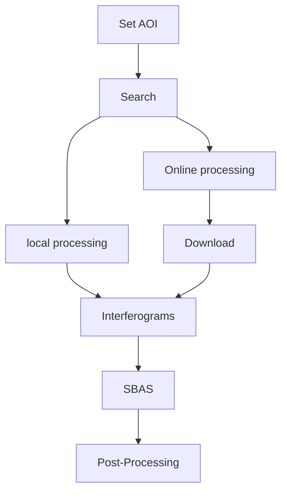
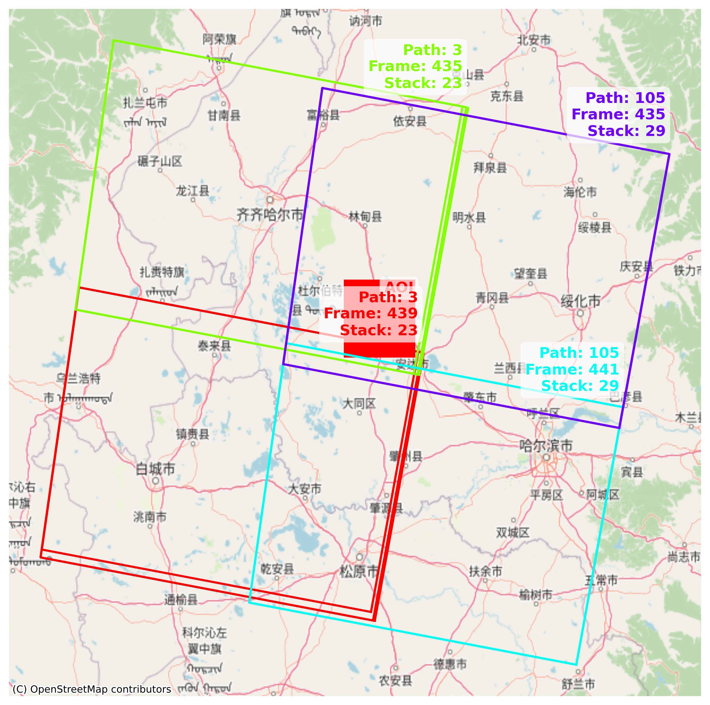
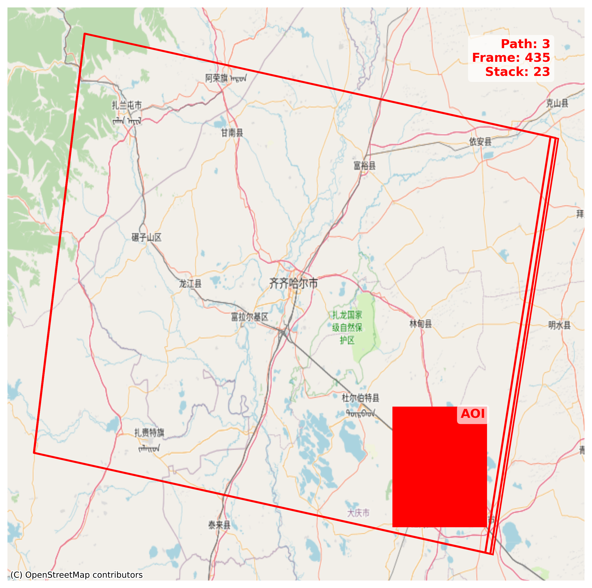

This section will get you on track as soon as possible. The complete InSAR time-series processing workflow includes:

<div style="text-align: center;">

</div>

!!! Note
    The example in QuickStart process Sentinel-1 SLCs under IW mode. 

## Set AOI

InSARScript current support bounding box method to select AOI. To define AOI, simply create a list of coordinates by:

```py
AOI = [124.67, 46.38, 125.35, 46.85]
```
The AOI should be specified as ***[min_long, min_lat, max_long, max_lat]***, this program will assume CRS of AOI is EPSG:4326 (WGS84)


## Search

Seaching and downloading of satellite scenes by using: 

```python
from insarscript import S1_SLC

s1 = S1_SLC(
    platform=['Sentinel-1A', 'Sentinel-1B', 'Sentinel-1C'],
    AscendingflightDirection=False,
    bbox = AOI,
    start='2020-01-01',
    end='2020-12-31',
    output_dir = '~/tmp',
)
results = s1.search()
s1.download()
```
This will download availiable Sentinel-1 SLCs that cover your AOI for local processing uses.

#### Filter search results

However, your AOI probably spans multiple scenes. To filter the search results, you can use:
```python 
s1.footprint()
```
This will display a footprint map of the available Sentinel-1 scenes that covers the AOI. The stack indicates numbers of SAR sences in that footprint
{: style="width:500px; display: block; margin: auto;" }

OR

```python
s1.summary()
```
This will output the summary of availiable Sentinel-1 scenes that covers the AOI. 

```bash
Sence: Path 3 Frame 439, Amount: 23, time: 2020-01-01 --> 2020-12-26
Sence: Path 3 Frame 435, Amount: 23, time: 2020-01-01 --> 2020-12-26
Sence: Path 105 Frame 441, Amount: 29, time: 2020-01-08 --> 2020-12-21
Sence: Path 105 Frame 435, Amount: 29, time: 2020-01-08 --> 2020-12-21

```
if we decide to choose two SAR sence stacks *(Path:3 Frame:435)* and *(Path:3 Frame:439)* for further process
, simply do: 

```python
filter_results = s1.pick((3,435))
```

You can then review the footprint and summary to confirm that the filter has been applied successfully.
```python
s1.footprint()
s1.summary()
```
Which would return: 

{: style="width:500px; display: block; margin: auto;" }
```python
Sence: Path 3 Frame 435, Amount: 23, time: 2020-01-01 --> 2020-12-26
```


## Interferogram Process

After locating SAR scene stacks that cover the Area of Interest (AOI), the next step is to generate unwrapped interferograms in preparation for the SBAS processing. There are two main options to accomplish this:

- Local Processing: Generate interferograms locally, starting from the raw SLC data.

- Online Processing with HyP3: Use the [HyP3 platform](https://hyp3-docs.asf.alaska.edu/)
 provided by ASF to run the interferometric processing in the cloud and download the resulting interferograms.

#### Local Processing (ISCE2)
!!! Abstract
    Local Processing is under development


#### Online Processing with HyP3

HyP3 is an online processing platform provided by ASF (Alaska Satellite Facility). To generate an interferogram, it takes a pair of Sentinel-1 granule IDs as input and produces one interferogram for that pair. InSARScript can automate this process. 

```python 
insar_job = hyp3.submit_insar_job('reference_granule_id', 'secondary_granule_id', 'job_name')
```


Assume we have five pairs of granule_ids:
```Python

pairs = [('S1B_IW_SLC__1SDV_20200101T215331_20200101T215358_019629_025190_2C0B', 'S1B_IW_SLC__1SDV_20200113T215331_20200113T215358_019804_025721_53E3'), ('S1B_IW_SLC__1SDV_20200101T215331_20200101T215358_019629_025190_2C0B', 'S1B_IW_SLC__1SDV_20200125T215331_20200125T215358_019979_025CB6_C45D'), ('S1B_IW_SLC__1SDV_20200101T215331_20200101T215358_019629_025190_2C0B', 'S1B_IW_SLC__1SDV_20200206T215330_20200206T215357_020154_026269_0B80'), ('S1B_IW_SLC__1SDV_20200101T215331_20200101T215358_019629_025190_2C0B', 'S1B_IW_SLC__1SDV_20200218T215330_20200218T215357_020329_02680A_426D'), ('S1B_IW_SLC__1SDV_20200101T215331_20200101T215358_019629_025190_2C0B', 'S1B_IW_SLC__1SDV_20200313T215330_20200313T215357_020679_027335_A83A')]
```

to submit these pairs, run: 

```python
from insarscript import Hyp3_InSAR_Processor

hyp3_insar = Hyp3_InSAR_Processor(
    pairs = pairs,
    out_dir = '~/tmp'
)
batch = hyp3_insar.submit()
```
Your processing requests have been submitted to the ASF server. You can check the processing status using:

```python
batch = hyp3_insar.refresh()
```

```
Output: 
Username: Your_ASF_UserName
Name:ifg_20200101T215331_20200218T215330 Job ID:68b2be08-2ad7-4cad-9bbb-3d33e8468300 Job type:INSAR_GAMMA Status:RUNNING
Name:ifg_20200101T215331_20200313T215330 Job ID:be57c44f-9514-4b92-8e7b-9e1c9c0d9d08 Job type:INSAR_GAMMA Status:RUNNING
Name:ifg_20200101T215331_20200206T215330 Job ID:c10cc297-2008-491d-a76c-c38958830d87 Job type:INSAR_GAMMA Status:RUNNING
Name:ifg_20200101T215331_20200125T215331 Job ID:61d48bb8-f86d-4b2a-b933-2709b653b86b Job type:INSAR_GAMMA Status:RUNNING
Name:ifg_20200101T215331_20200113T215331 Job ID:28a7f5e7-d8d4-4958-854f-a7e625a0a09e Job type:INSAR_GAMMA Status:RUNNING
```
Processing will take roughly 30 mins for every 100 interferograms depends on the ASF server load, you can save the job script to check back later by:

```python
savepath = hyp3_insar.save()
```
This will save current job ids into a JSON file, named hyp3_jobs.json under your workdir by default (e.g. `~/tmp/hyp3_jobs.json`). The job script will looks like: 

```json
{
  "job_ids": {
    "Your_ASF_UserName": [
      "28a7f5e7-d8d4-4958-854f-a7e625a0a09e",
      "61d48bb8-f86d-4b2a-b933-2709b653b86b",
      "c10cc297-2008-491d-a76c-c38958830d87",
      "68b2be08-2ad7-4cad-9bbb-3d33e8468300",
      "be57c44f-9514-4b92-8e7b-9e1c9c0d9d08"
    ]
  },
  "out_dir": "/Your/Project/Save/Path"
}
```
To load back this job, simply use: 

```python
hyp3_insar_reload = Hyp3_InSAR_Processor.load(path = '~/tmp/hyp3_jobs.json')
batchs = hyp3_insar_reload.refresh()
```
```
Output:
Username: Your_ASF_UserName
Name:ifg_20200101T215331_20200218T215330 Job ID:68b2be08-2ad7-4cad-9bbb-3d33e8468300 Job type:INSAR_GAMMA Status:SUCCEEDED
Name:ifg_20200101T215331_20200313T215330 Job ID:be57c44f-9514-4b92-8e7b-9e1c9c0d9d08 Job type:INSAR_GAMMA Status:SUCCEEDED
Name:ifg_20200101T215331_20200206T215330 Job ID:c10cc297-2008-491d-a76c-c38958830d87 Job type:INSAR_GAMMA Status:SUCCEEDED
Name:ifg_20200101T215331_20200125T215331 Job ID:61d48bb8-f86d-4b2a-b933-2709b653b86b Job type:INSAR_GAMMA Status:SUCCEEDED
Name:ifg_20200101T215331_20200113T215331 Job ID:28a7f5e7-d8d4-4958-854f-a7e625a0a09e Job type:INSAR_GAMMA Status:SUCCEEDED
```
Seems all interferograms are ready! 

You can download these interferograms by: 

```python
hyp3_insar_reload.download()
```
```
S1BB_20200101T215331_20200218T215330_VVP048_INT80_G_weF_5991.zip: 100%|██████████████████████████████████████████████████| 338M/338M [00:11<00:00, 29.9MB/s]
S1BB_20200101T215331_20200313T215330_VVP072_INT80_G_weF_4CCA.zip: 100%|██████████████████████████████████████████████████| 340M/340M [00:07<00:00, 50.4MB/s]
S1BB_20200101T215331_20200206T215330_VVP036_INT80_G_weF_0C8D.zip: 100%|██████████████████████████████████████████████████| 335M/335M [00:07<00:00, 47.8MB/s]
S1BB_20200101T215331_20200125T215331_VVP024_INT80_G_weF_74ED.zip: 100%|██████████████████████████████████████████████████| 334M/334M [00:10<00:00, 31.9MB/s]
S1BB_20200101T215331_20200113T215331_VVP012_INT80_G_weF_EE06.zip: 100%|██████████████████████████████████████████████████| 336M/336M [00:06<00:00, 53.0MB/s]
Downloading:: 100%|███████████████████████████████████████████████████████████████████████████████████████████████████████████| 5/5 [00:55<00:00, 11.13s/it]
```
Once all downloads are complete, you should be able to find the compressed .zip files in your working directory, these contain your processed interferograms!

*[AOI]: Area of interest
*[CRS]: Coordinate Reference System
*[SLC]: Single Look Complex
*[SBAS]: Small Baseline Subset

## SBAS

Running SBAS requires a set of interferograms generated from SAR image pairs with small spatial and temporal baselines. This approach is designed to minimize phase decorrelation and improve the quality of the deformation signal.

InSARScript utilizes [MintPy](https://github.com/insarlab/MintPy), a powerful open-source toolbox for InSAR time-series analysis, to perform the SBAS workflow.

#### Connect with ISCE2 
!!! Abstract
    ISCE2 connection is Under development 

#### Connect with HyP3
Let's look back to the `filter_results` we generated in the Search section: 

```python
from insarscript import S1_SLC
AOI = [124.67, 46.38, 125.35, 46.85]
s1 = S1_SLC(
    platform=['Sentinel-1A', 'Sentinel-1B', 'Sentinel-1C'],
    AscendingflightDirection=False,
    bbox = AOI,
    start='2020-01-01',
    end='2020-12-31',
    output_dir = '~/tmp',
)
results = s1.search()
filter_results = s1.pick((3,435))
```
Before submitting jobs to HyP3 to generate interferograms, we first need to prepare the list of connection pairs.

```python
from insarscript import select_pairs
sbas_pairs = select_pairs(search_results= filter_results[(3,435)])
```
For this particular stack of scenes, it returns 83 pairs, each representing a valid interferometric connection based on default baseline thresholds.
```
>>> sbas_pairs
[('S1B_IW_SLC__1SDV_20200101T215331_20200101T215358_019629_025190_2C0B', 'S1B_IW_SLC__1SDV_20200113T215331_20200113T215358_019804_025721_53E3'), ('S1B_IW_SLC__1SDV_20200101T215331_20200101T215358_019629_025190_2C0B', 'S1B_IW_SLC__1SDV_20200125T215331_20200125T215358_019979_025CB6_C45D'), ('S1B_IW_SLC__1SDV_20200101T215331_20200101T215358_019629_025190_2C0B', 'S1B_IW_SLC__1SDV_20200206T215330_20200206T215357_020154_026269_0B80'), ('S1B_IW_SLC__1SDV_20200101T215331_20200101T215358_019629_025190_2C0B', 'S1B_IW_SLC__1SDV_20200218T215330_20200218T215357_020329_02680A_426D'), ('S1B_IW_SLC__1SDV_20200101T215331_20200101T215358_019629_025190_2C0B', 'S1B_IW_SLC__1SDV_20200313T215330_20200313T215357_020679_027335_A83A'), ('S1B_IW_SLC__1SDV_20200101T215331_20200101T215358_019629_025190_2C0B', 'S1B_IW_SLC__1SDV_20200406T215330_20200406T215357_021029_027E44_E25E'), ('S1B_IW_SLC__1SDV_20200113T215331_20200113T215358_019804_025721_53E3', 'S1B_IW_SLC__1SDV_20200125T215331_20200125T215358_019979_025CB6_C45D'), ('S1B_IW_SLC__1SDV_20200113T215331_20200113T215358_019804_025721_53E3', 'S1B_IW_SLC__1SDV_20200206T215330_20200206T215357_020154_026269_0B80'), ('S1B_IW_SLC__1SDV_20200113T215331_20200113T215358_019804_025721_53E3', 'S1B_IW_SLC__1SDV_20200218T215330_20200218T215357_020329_02680A_426D'), ('S1B_IW_SLC__1SDV_20200113T215331_20200113T215358_019804_025721_53E3', 'S1B_IW_SLC__1SDV_20200301T215330_20200301T215357_020504_026DA9_212B'), ('S1B_IW_SLC__1SDV_20200113T215331_20200113T215358_019804_025721_53E3', 'S1B_IW_SLC__1SDV_20200325T215330_20200325T215357_020854_0278BD_7268'), ('S1B_IW_SLC__1SDV_20200113T215331_20200113T215358_019804_025721_53E3', 'S1B_IW_SLC__1SDV_20200418T215331_20200418T215358_021204_0283CE_1664'), ('S1B_IW_SLC__1SDV_20200125T215331_20200125T215358_019979_025CB6_C45D', 'S1B_IW_SLC__1SDV_20200206T215330_20200206T215357_020154_026269_0B80'), ('S1B_IW_SLC__1SDV_20200125T215331_20200125T215358_019979_025CB6_C45D', 'S1B_IW_SLC__1SDV_20200218T215330_20200218T215357_020329_02680A_426D'), ('S1B_IW_SLC__1SDV_20200125T215331_20200125T215358_019979_025CB6_C45D', 'S1B_IW_SLC__1SDV_20200313T215330_20200313T215357_020679_027335_A83A'), ('S1B_IW_SLC__1SDV_20200125T215331_20200125T215358_019979_025CB6_C45D', 'S1B_IW_SLC__1SDV_20200406T215330_20200406T215357_021029_027E44_E25E'), ('S1B_IW_SLC__1SDV_20200206T215330_20200206T215357_020154_026269_0B80', 'S1B_IW_SLC__1SDV_20200218T215330_20200218T215357_020329_02680A_426D'), ('S1B_IW_SLC__1SDV_20200206T215330_20200206T215357_020154_026269_0B80', 'S1B_IW_SLC__1SDV_20200313T215330_20200313T215357_020679_027335_A83A'), ('S1B_IW_SLC__1SDV_20200206T215330_20200206T215357_020154_026269_0B80', 'S1B_IW_SLC__1SDV_20200325T215330_20200325T215357_020854_0278BD_7268'), ('S1B_IW_SLC__1SDV_20200206T215330_20200206T215357_020154_026269_0B80', 'S1B_IW_SLC__1SDV_20200418T215331_20200418T215358_021204_0283CE_1664'), ('S1B_IW_SLC__1SDV_20200218T215330_20200218T215357_020329_02680A_426D', 'S1B_IW_SLC__1SDV_20200301T215330_20200301T215357_020504_026DA9_212B'), ('S1B_IW_SLC__1SDV_20200218T215330_20200218T215357_020329_02680A_426D', 'S1B_IW_SLC__1SDV_20200313T215330_20200313T215357_020679_027335_A83A'), ('S1B_IW_SLC__1SDV_20200218T215330_20200218T215357_020329_02680A_426D', 'S1B_IW_SLC__1SDV_20200325T215330_20200325T215357_020854_0278BD_7268'), ('S1B_IW_SLC__1SDV_20200218T215330_20200218T215357_020329_02680A_426D', 'S1B_IW_SLC__1SDV_20200406T215330_20200406T215357_021029_027E44_E25E'), ('S1B_IW_SLC__1SDV_20200218T215330_20200218T215357_020329_02680A_426D', 'S1B_IW_SLC__1SDV_20200430T215331_20200430T215359_021379_028953_F4D1'), ('S1B_IW_SLC__1SDV_20200301T215330_20200301T215357_020504_026DA9_212B', 'S1B_IW_SLC__1SDV_20200313T215330_20200313T215357_020679_027335_A83A'), ('S1B_IW_SLC__1SDV_20200301T215330_20200301T215357_020504_026DA9_212B', 'S1B_IW_SLC__1SDV_20200325T215330_20200325T215357_020854_0278BD_7268'), ('S1B_IW_SLC__1SDV_20200301T215330_20200301T215357_020504_026DA9_212B', 'S1B_IW_SLC__1SDV_20200418T215331_20200418T215358_021204_0283CE_1664'), ('S1B_IW_SLC__1SDV_20200313T215330_20200313T215357_020679_027335_A83A', 'S1B_IW_SLC__1SDV_20200325T215330_20200325T215357_020854_0278BD_7268'), ('S1B_IW_SLC__1SDV_20200313T215330_20200313T215357_020679_027335_A83A', 'S1B_IW_SLC__1SDV_20200406T215330_20200406T215357_021029_027E44_E25E'), ('S1B_IW_SLC__1SDV_20200313T215330_20200313T215357_020679_027335_A83A', 'S1B_IW_SLC__1SDV_20200418T215331_20200418T215358_021204_0283CE_1664'), ('S1B_IW_SLC__1SDV_20200313T215330_20200313T215357_020679_027335_A83A', 'S1B_IW_SLC__1SDV_20200430T215331_20200430T215359_021379_028953_F4D1'), ('S1B_IW_SLC__1SDV_20200313T215330_20200313T215357_020679_027335_A83A', 'S1B_IW_SLC__1SDV_20200617T215334_20200617T215401_022079_029E6C_FF0A'), ('S1B_IW_SLC__1SDV_20200325T215330_20200325T215357_020854_0278BD_7268', 'S1B_IW_SLC__1SDV_20200406T215330_20200406T215357_021029_027E44_E25E'), ('S1B_IW_SLC__1SDV_20200325T215330_20200325T215357_020854_0278BD_7268', 'S1B_IW_SLC__1SDV_20200418T215331_20200418T215358_021204_0283CE_1664'), ('S1B_IW_SLC__1SDV_20200325T215330_20200325T215357_020854_0278BD_7268', 'S1B_IW_SLC__1SDV_20200430T215331_20200430T215359_021379_028953_F4D1'), ('S1B_IW_SLC__1SDV_20200406T215330_20200406T215357_021029_027E44_E25E', 'S1B_IW_SLC__1SDV_20200418T215331_20200418T215358_021204_0283CE_1664'), ('S1B_IW_SLC__1SDV_20200406T215330_20200406T215357_021029_027E44_E25E', 'S1B_IW_SLC__1SDV_20200430T215331_20200430T215359_021379_028953_F4D1'), ('S1B_IW_SLC__1SDV_20200406T215330_20200406T215357_021029_027E44_E25E', 'S1B_IW_SLC__1SDV_20200617T215334_20200617T215401_022079_029E6C_FF0A'), ('S1B_IW_SLC__1SDV_20200406T215330_20200406T215357_021029_027E44_E25E', 'S1B_IW_SLC__1SDV_20200711T215335_20200711T215403_022429_02A91E_5F7E'), ('S1B_IW_SLC__1SDV_20200418T215331_20200418T215358_021204_0283CE_1664', 'S1B_IW_SLC__1SDV_20200430T215331_20200430T215359_021379_028953_F4D1'), ('S1B_IW_SLC__1SDV_20200418T215331_20200418T215358_021204_0283CE_1664', 'S1B_IW_SLC__1SDV_20200723T215336_20200723T215403_022604_02AE6B_BFA0'), ('S1B_IW_SLC__1SDV_20200430T215331_20200430T215359_021379_028953_F4D1', 'S1B_IW_SLC__1SDV_20200617T215334_20200617T215401_022079_029E6C_FF0A'), ('S1B_IW_SLC__1SDV_20200430T215331_20200430T215359_021379_028953_F4D1', 'S1B_IW_SLC__1SDV_20200711T215335_20200711T215403_022429_02A91E_5F7E'), ('S1B_IW_SLC__1SDV_20200430T215331_20200430T215359_021379_028953_F4D1', 'S1B_IW_SLC__1SDV_20200804T215337_20200804T215404_022779_02B3BA_EE5A'), ('S1B_IW_SLC__1SDV_20200617T215334_20200617T215401_022079_029E6C_FF0A', 'S1B_IW_SLC__1SDV_20200711T215335_20200711T215403_022429_02A91E_5F7E'), ('S1B_IW_SLC__1SDV_20200617T215334_20200617T215401_022079_029E6C_FF0A', 'S1B_IW_SLC__1SDV_20200723T215336_20200723T215403_022604_02AE6B_BFA0'), ('S1B_IW_SLC__1SDV_20200617T215334_20200617T215401_022079_029E6C_FF0A', 'S1B_IW_SLC__1SDV_20200804T215337_20200804T215404_022779_02B3BA_EE5A'), ('S1B_IW_SLC__1SDV_20200617T215334_20200617T215401_022079_029E6C_FF0A', 'S1B_IW_SLC__1SDV_20200828T215338_20200828T215406_023129_02BEA7_3124'), ('S1B_IW_SLC__1SDV_20200617T215334_20200617T215401_022079_029E6C_FF0A', 'S1B_IW_SLC__1SDV_20200921T215339_20200921T215406_023479_02C9A1_C052'), ('S1B_IW_SLC__1SDV_20200711T215335_20200711T215403_022429_02A91E_5F7E', 'S1B_IW_SLC__1SDV_20200723T215336_20200723T215403_022604_02AE6B_BFA0'), ('S1B_IW_SLC__1SDV_20200711T215335_20200711T215403_022429_02A91E_5F7E', 'S1B_IW_SLC__1SDV_20200804T215337_20200804T215404_022779_02B3BA_EE5A'), ('S1B_IW_SLC__1SDV_20200711T215335_20200711T215403_022429_02A91E_5F7E', 'S1B_IW_SLC__1SDV_20200816T215338_20200816T215405_022954_02B928_36DA'), ('S1B_IW_SLC__1SDV_20200711T215335_20200711T215403_022429_02A91E_5F7E', 'S1B_IW_SLC__1SDV_20200828T215338_20200828T215406_023129_02BEA7_3124'), ('S1B_IW_SLC__1SDV_20200711T215335_20200711T215403_022429_02A91E_5F7E', 'S1B_IW_SLC__1SDV_20200921T215339_20200921T215406_023479_02C9A1_C052'), ('S1B_IW_SLC__1SDV_20200711T215335_20200711T215403_022429_02A91E_5F7E', 'S1B_IW_SLC__1SDV_20201015T215340_20201015T215407_023829_02D48B_23A9'), ('S1B_IW_SLC__1SDV_20200723T215336_20200723T215403_022604_02AE6B_BFA0', 'S1B_IW_SLC__1SDV_20200804T215337_20200804T215404_022779_02B3BA_EE5A'), ('S1B_IW_SLC__1SDV_20200723T215336_20200723T215403_022604_02AE6B_BFA0', 'S1B_IW_SLC__1SDV_20200816T215338_20200816T215405_022954_02B928_36DA'), ('S1B_IW_SLC__1SDV_20200723T215336_20200723T215403_022604_02AE6B_BFA0', 'S1B_IW_SLC__1SDV_20200828T215338_20200828T215406_023129_02BEA7_3124'), ('S1B_IW_SLC__1SDV_20200723T215336_20200723T215403_022604_02AE6B_BFA0', 'S1B_IW_SLC__1SDV_20201003T215339_20201003T215407_023654_02CF1B_F664'), ('S1B_IW_SLC__1SDV_20200723T215336_20200723T215403_022604_02AE6B_BFA0', 'S1B_IW_SLC__1SDV_20201027T215340_20201027T215407_024004_02DA0A_F8B2'), ('S1B_IW_SLC__1SDV_20200804T215337_20200804T215404_022779_02B3BA_EE5A', 'S1B_IW_SLC__1SDV_20200816T215338_20200816T215405_022954_02B928_36DA'), ('S1B_IW_SLC__1SDV_20200804T215337_20200804T215404_022779_02B3BA_EE5A', 'S1B_IW_SLC__1SDV_20200828T215338_20200828T215406_023129_02BEA7_3124'), ('S1B_IW_SLC__1SDV_20200804T215337_20200804T215404_022779_02B3BA_EE5A', 'S1B_IW_SLC__1SDV_20200921T215339_20200921T215406_023479_02C9A1_C052'), ('S1B_IW_SLC__1SDV_20200804T215337_20200804T215404_022779_02B3BA_EE5A', 'S1B_IW_SLC__1SDV_20201015T215340_20201015T215407_023829_02D48B_23A9'), ('S1B_IW_SLC__1SDV_20200816T215338_20200816T215405_022954_02B928_36DA', 'S1B_IW_SLC__1SDV_20200828T215338_20200828T215406_023129_02BEA7_3124'), ('S1B_IW_SLC__1SDV_20200816T215338_20200816T215405_022954_02B928_36DA', 'S1B_IW_SLC__1SDV_20200921T215339_20200921T215406_023479_02C9A1_C052'), ('S1B_IW_SLC__1SDV_20200816T215338_20200816T215405_022954_02B928_36DA', 'S1B_IW_SLC__1SDV_20201003T215339_20201003T215407_023654_02CF1B_F664'), ('S1B_IW_SLC__1SDV_20200816T215338_20200816T215405_022954_02B928_36DA', 'S1B_IW_SLC__1SDV_20201027T215340_20201027T215407_024004_02DA0A_F8B2'), ('S1B_IW_SLC__1SDV_20200828T215338_20200828T215406_023129_02BEA7_3124', 'S1B_IW_SLC__1SDV_20200921T215339_20200921T215406_023479_02C9A1_C052'), ('S1B_IW_SLC__1SDV_20200828T215338_20200828T215406_023129_02BEA7_3124', 'S1B_IW_SLC__1SDV_20201003T215339_20201003T215407_023654_02CF1B_F664'), ('S1B_IW_SLC__1SDV_20200828T215338_20200828T215406_023129_02BEA7_3124', 'S1B_IW_SLC__1SDV_20201015T215340_20201015T215407_023829_02D48B_23A9'), ('S1B_IW_SLC__1SDV_20200921T215339_20200921T215406_023479_02C9A1_C052', 'S1B_IW_SLC__1SDV_20201003T215339_20201003T215407_023654_02CF1B_F664'), ('S1B_IW_SLC__1SDV_20200921T215339_20200921T215406_023479_02C9A1_C052', 'S1B_IW_SLC__1SDV_20201015T215340_20201015T215407_023829_02D48B_23A9'), ('S1B_IW_SLC__1SDV_20200921T215339_20200921T215406_023479_02C9A1_C052', 'S1B_IW_SLC__1SDV_20201027T215340_20201027T215407_024004_02DA0A_F8B2'), ('S1B_IW_SLC__1SDV_20200921T215339_20200921T215406_023479_02C9A1_C052', 'S1B_IW_SLC__1SDV_20201226T215338_20201226T215405_024879_02F5DA_AC3F'), ('S1B_IW_SLC__1SDV_20201003T215339_20201003T215407_023654_02CF1B_F664', 'S1B_IW_SLC__1SDV_20201015T215340_20201015T215407_023829_02D48B_23A9'), ('S1B_IW_SLC__1SDV_20201003T215339_20201003T215407_023654_02CF1B_F664', 'S1B_IW_SLC__1SDV_20201027T215340_20201027T215407_024004_02DA0A_F8B2'), ('S1B_IW_SLC__1SDV_20201003T215339_20201003T215407_023654_02CF1B_F664', 'S1B_IW_SLC__1SDV_20201214T215338_20201214T215405_024704_02F02E_8CBB'), ('S1B_IW_SLC__1SDV_20201015T215340_20201015T215407_023829_02D48B_23A9', 'S1B_IW_SLC__1SDV_20201027T215340_20201027T215407_024004_02DA0A_F8B2'), ('S1B_IW_SLC__1SDV_20201015T215340_20201015T215407_023829_02D48B_23A9', 'S1B_IW_SLC__1SDV_20201226T215338_20201226T215405_024879_02F5DA_AC3F'), ('S1B_IW_SLC__1SDV_20201027T215340_20201027T215407_024004_02DA0A_F8B2', 'S1B_IW_SLC__1SDV_20201214T215338_20201214T215405_024704_02F02E_8CBB'), ('S1B_IW_SLC__1SDV_20201214T215338_20201214T215405_024704_02F02E_8CBB', 'S1B_IW_SLC__1SDV_20201226T215338_20201226T215405_024879_02F5DA_AC3F')]
```

We now submit our selected pairs to HyP3 for interferogram processing and save job script:

```python
from insarscript import Hyp3_InSAR_Processor
hyp3_sbas = Hyp3_InSAR_Processor(
    pairs = sbas_pairs,
    out_dir = '~/tmp'
)
batch = hyp3_sbas.submit()
hyp3_sbas.save()
hyp3_sbas.refresh()
```

Once processing is complete download all interferograms:

```python
hyp3_sbas.download()

```
We can then perfrom SBAS: 

```python
from insarscript import Hyp3_SBAS
sbas_run = Hyp3_SBAS(
    hyp3_dir = '~/tmp'
)
sbas_run.prep_data()
sbas_run.run()
```
