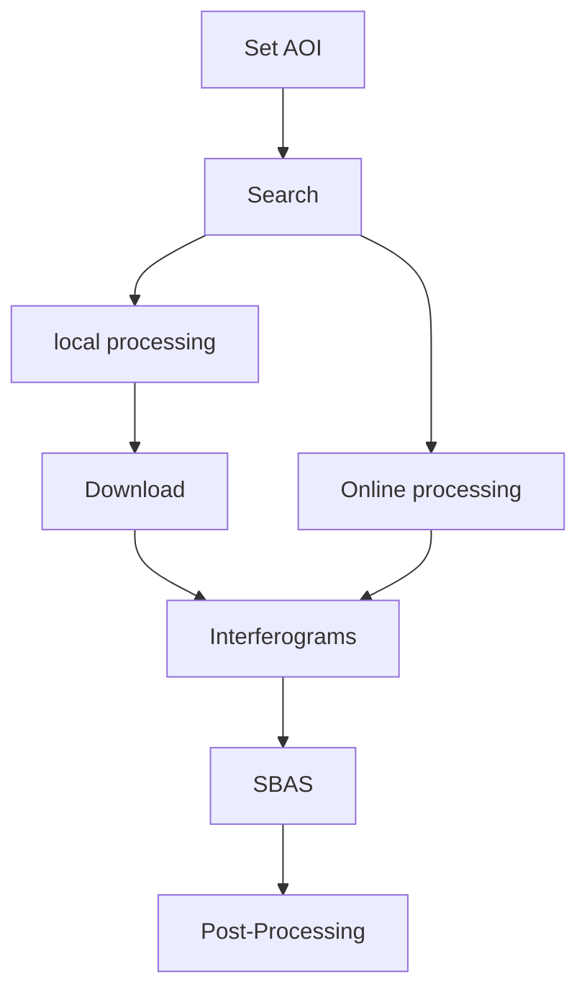

This section demonstrates the workflow of the package. The complete InSAR time-series processing workflow includes:



## Set AOI

InSARScript current support bounding box method to select AOI. To define AOI, simply create a list of coordinates by:

```py
AOI = [124.3, 45.0, 125.0, 46.0]
```
The AOI should be specified as ***[min_long, min_lat, max_long, max_lat]***, this program will assume CRS of AOI is EPSG:4326 (WGS84)

*[AOI]: Area of interest
*[CRS]: Coordinate Reference System


## Search

Seaching and downloading of satellite scenes is done by asf_search